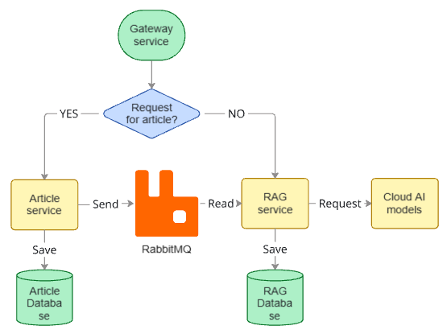

# Архитектура системы

Система построена по принципу разделения ответственности между сервисами хранения, обработки и генерации данных, с использованием событийной модели взаимодействия.

## Общая схема взаимодействия

1. Клиентский запрос поступает в **gateway сервис**
2. Gateway определяет тип запроса:

    * запрос на получение/изменение статьи → **article сервис**
    * запрос на генерацию ответа → **RAG сервис**
3. При изменении данных **article сервис** публикует событие в очередь
4. **RAG сервис** асинхронно обрабатывает события и обновляет векторное представление данных
5. При пользовательском запросе RAG формирует ответ с использованием облачных моделей

## Компоненты системы

### Gateway сервис

Отвечает за маршрутизацию входящих запросов:

* определяет тип запроса (CRUD статьи / вопрос пользователя)
* проксирует запрос в соответствующий сервис
* не содержит бизнес-логики

### Article сервис

Сервис управления статьями и исходными данными.

Функции:

* хранение статей в базе данных
* обработка операций:

    * создание
    * обновление
    * удаление
* публикация событий в очередь при изменениях

Пайплайн обработки:

1. Сохранение статьи в БД
2. Отправка события в брокер (event-driven подход)

Типы событий:

* `ARTICLE_CREATED`
* `ARTICLE_UPDATED`
* `ARTICLE_DELETED`

[//]: # (  // todo - в текущий момент не реализовано удаление)

### Брокер сообщений — RabbitMQ

Используется как асинхронный транспорт событий между сервисами.

Функции:

* буферизация событий
* обеспечение eventual consistency

Преимущества:

* RAG сервис не зависит от доступности article сервиса
* масштабируемость обработки

### RAG сервис

Ключевой компонент, реализующий подход Retrieval-Augmented Generation.

Функции:

* потребление событий из брокера
* подготовка данных:

    * чанкинг текста
    * генерация embeddings
* хранение векторного представления
* обработка пользовательских запросов

#### Обработка данных (offline pipeline)

1. Получение события из очереди
2. Загрузка статьи
3. Разбиение на чанки
4. Векторизация чанков
5. Сохранение в векторную БД (PostgreSQL + pgvector)

#### Обработка пользовательского запроса (online pipeline)

1. Векторизация запроса
2. Поиск релевантных чанков (top-k)
3. Формирование контекста
4. Генерация ответа через LLM

### Хранилище RAG (Vector DB)

Реализовано на базе PostgreSQL с расширением:

* pgvector

Хранит:

* embeddings чанков
* текст чанков
* метаданные (article_id, версия, и т.д.)

## Облачные модели

### 1. Модель векторизации (Embedding model)

Используется для:

* векторизации чанков статей
* векторизации пользовательского запроса

Требования:

* единое embedding-пространство
* высокая семантическая точность

### 2. LLM (генеративная модель)

Используется для:

* формирования финального ответа пользователю
* работы в парадигме RAG

Вход:

* пользовательский запрос
* найденный контекст

Выход:

* сгенерированный ответ с учётом релевантных данных

## Архитектурные особенности

### Событийная модель

* асинхронная обработка через брокер
* слабая связность сервисов

### Разделение pipeline

* ingestion pipeline (article → RAG)
* query pipeline (user → RAG → LLM)

### Консистентность

* eventual consistency между Article DB и RAG DB

## Преимущества архитектуры

* масштабируемость (разделение сервисов)
* независимое развитие компонентов
* возможность замены моделей без изменения ядра системы
* эффективная работа с семантическим поиском

## Ограничения

* задержка обновления данных в RAG (eventual consistency)
* зависимость от качества embedding модели
* дополнительные накладные расходы на инфраструктуру (очередь, векторная БД)
