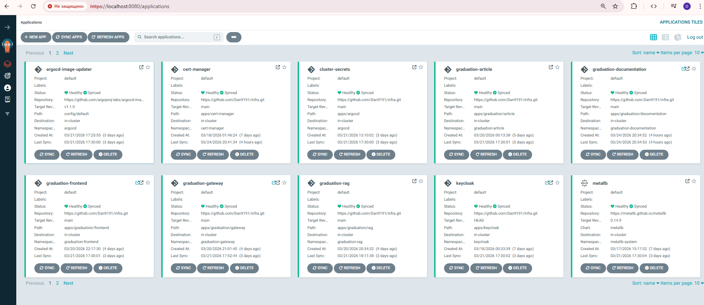

# Инфраструктурный репозиторий

 [https://github.com/Dan9191/infra](https://github.com/Dan9191/infra)


## Kubernetes кластер

Кластер развернут на базе:
k3s

Причины выбора:

* низкие требования к ресурсам
* простота установки
* подходит для pet-проектов и MVP

## Управление через Argo CD

Argo CD:

* отслеживает изменения в репозитории
* автоматически применяет манифесты
* обеспечивает декларативное управление
## Структура приложений

### Бизнес-приложения

```
root/graduation/
  article.yaml
  gateway.yaml
  rag.yaml
  frontend.yaml
  documentation.yaml
```
### Инфраструктурные компоненты

```
root/
  postgres.yaml
  rabbitmq.yaml
  keycloak.yaml
  ingress-nginx.yaml
  cert-manager.yaml
  metallb.yaml
  metallb-config.yaml
  sealed-secrets.yaml
  cluster-secrets.yaml
  storage.yaml
```

## Принцип работы

1. Образы публикуются в registry (GHCR)
2. В манифестах указан тег образа
3. Argo CD синхронизирует состояние
4. Kubernetes применяет изменения

## Текущие ограничения

* обновление image tag выполняется вручную
* нет автоматического rollout при новом образе

## Планируемые улучшения

### Автоматизация деплоя

Планируется использование:

* Argo CD Image Updater

Функции:

* отслеживание новых образов в registry
* автоматическое обновление тегов
* автодеплой без участия разработчика
