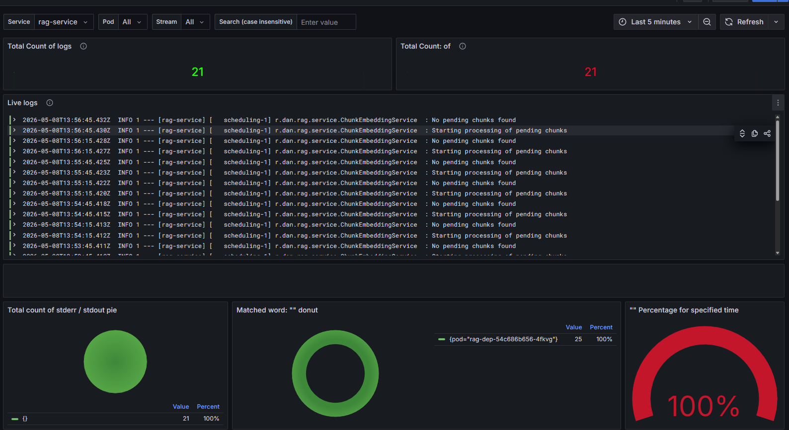
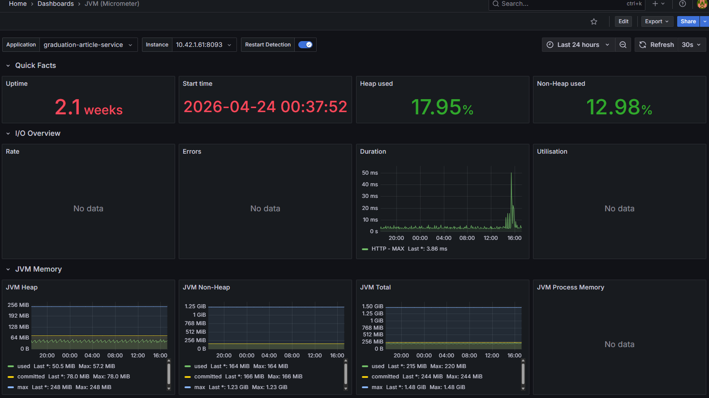

# Observability (в разработке)

Планируется внедрение полноценной observability-стека.

## Цели

* мониторинг состояния сервисов
* сбор метрик
* централизованное логирование

## Компоненты

[https://grafana.mos-hack.ru/dashboards](https://grafana.mos-hack.ru/dashboards)
### Метрики — Prometheus

Используется для:

* сбора метрик с сервисов
* хранения временных рядов

### Логи — Grafana Loki

Используется для:

* централизованного сбора логов
* поиска и анализа логов
* интеграции с Grafana

### Визуализация — Grafana

Используется для:

* дашборды по сервисам
* метрики RAG (latency, retrieval time)
* инфраструктурные метрики
