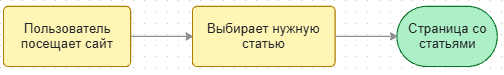
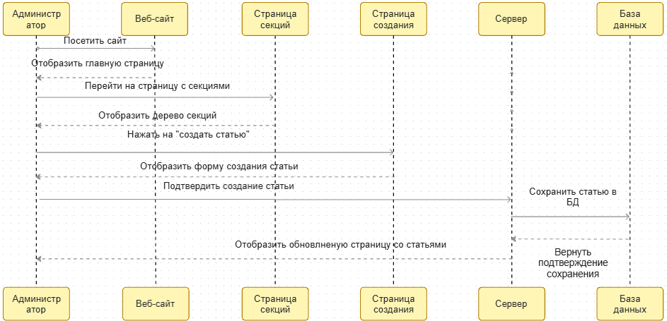
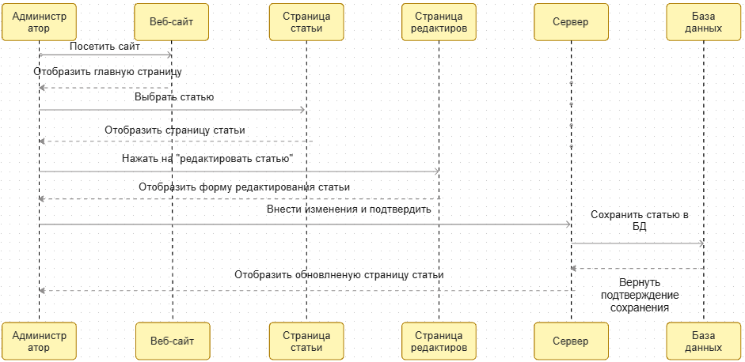
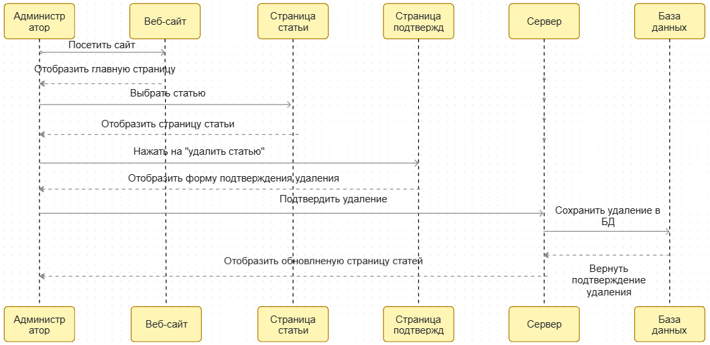

# Статьи

## Определение
Статьи - основная самостоятельная единица для хранения информации.
Выполняет роль листьев для дерева секций.

## Пользовательская история:

### Как пользователь, хочу просматривать статью

### Как администратор, хочу создавать статью

### Как администратор, хочу редактировать статью

### Как администратор, хочу удалять статью

