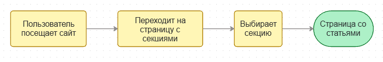
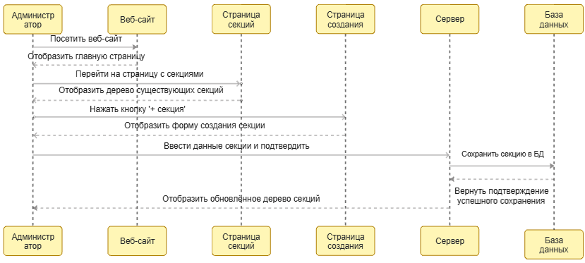
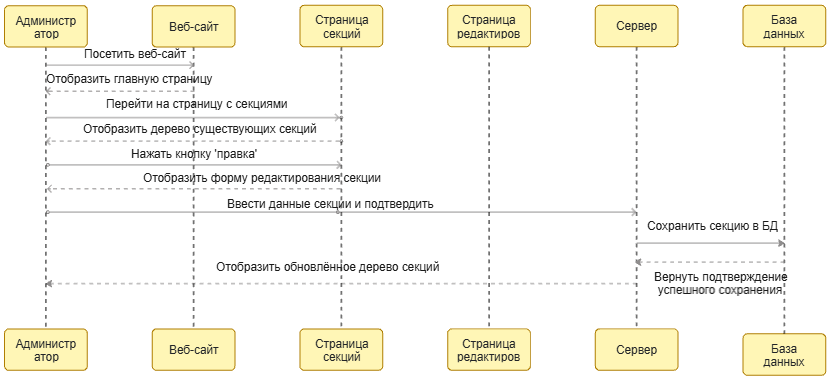
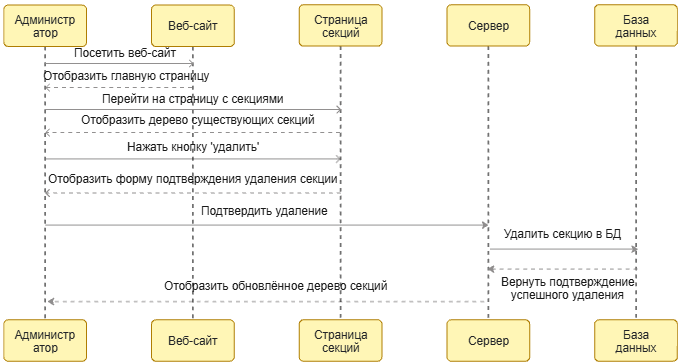

# Секции

## Определение
Секция - Составная часть древовидной структуры, используемый для хранения информации.
Помогает структурировать данные и улучшить навигацию.

## Пользовательская история:

### Как пользователь, хочу перейти по секции и увидеть все доступные статьи
  

### Как администратор, хочу создавать секции
  

### Как администратор, хочу редактировать секции
  

### Как администратор, хочу удалять секции
  