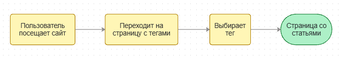
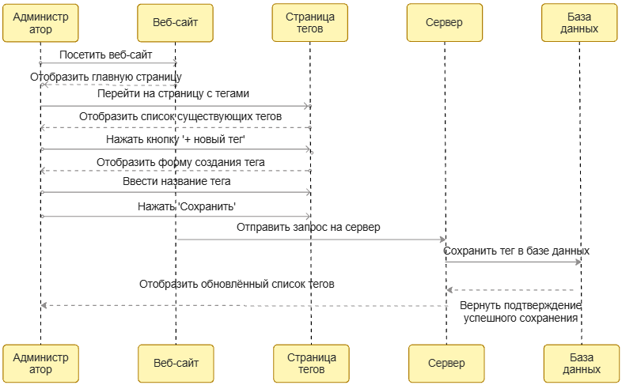
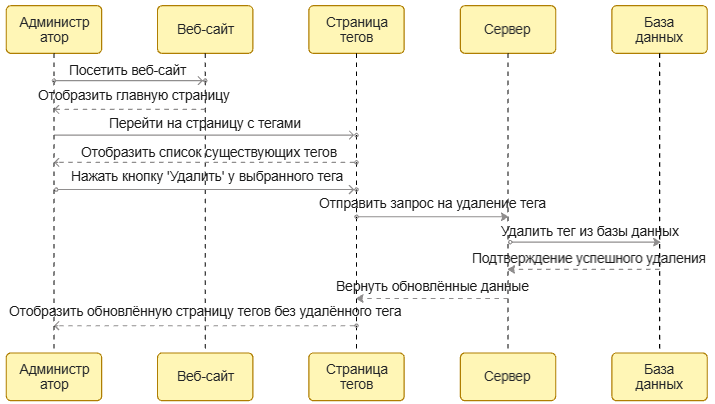

# Теги

## Определение
Теги - ключевые слова и метки, используемые для поиска схожей информации.
Помогают структурировать данные и улучшить навигацию.

## Пользовательская история:

### Как пользователь, хочу перейти по тегу и увидеть все доступные статьи
  

### Как администратор, хочу создавать теги
  

### Как администратор, хочу удалять теги
  