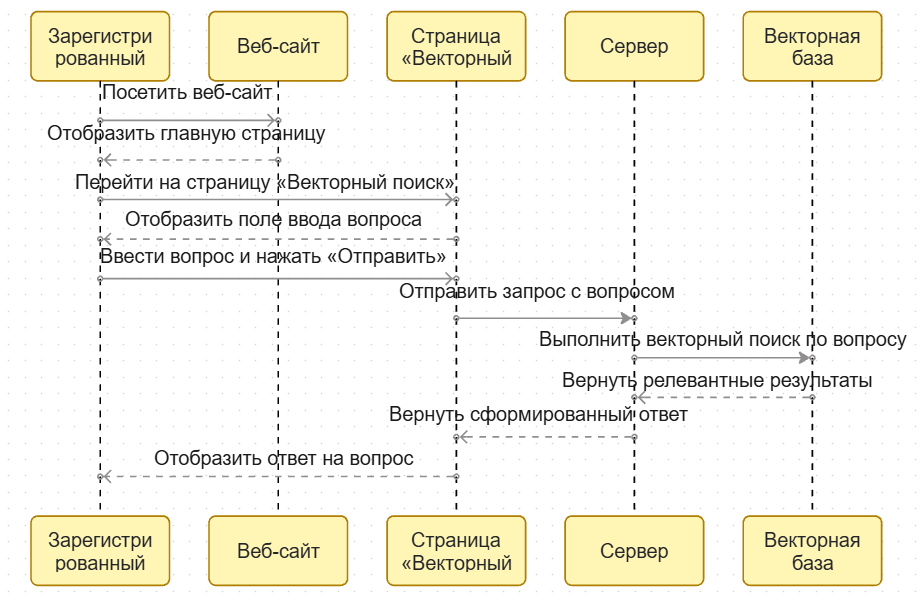

# Векторный поиск.

## Определение.
Векторный поиск - метод поиска данных, основанный на математическом сравнении смысла объектов, а не точных ключевых слов.

## Пользовательская история:

### Как зарегистрированный пользователь, хочу получить ответ на вопрос
